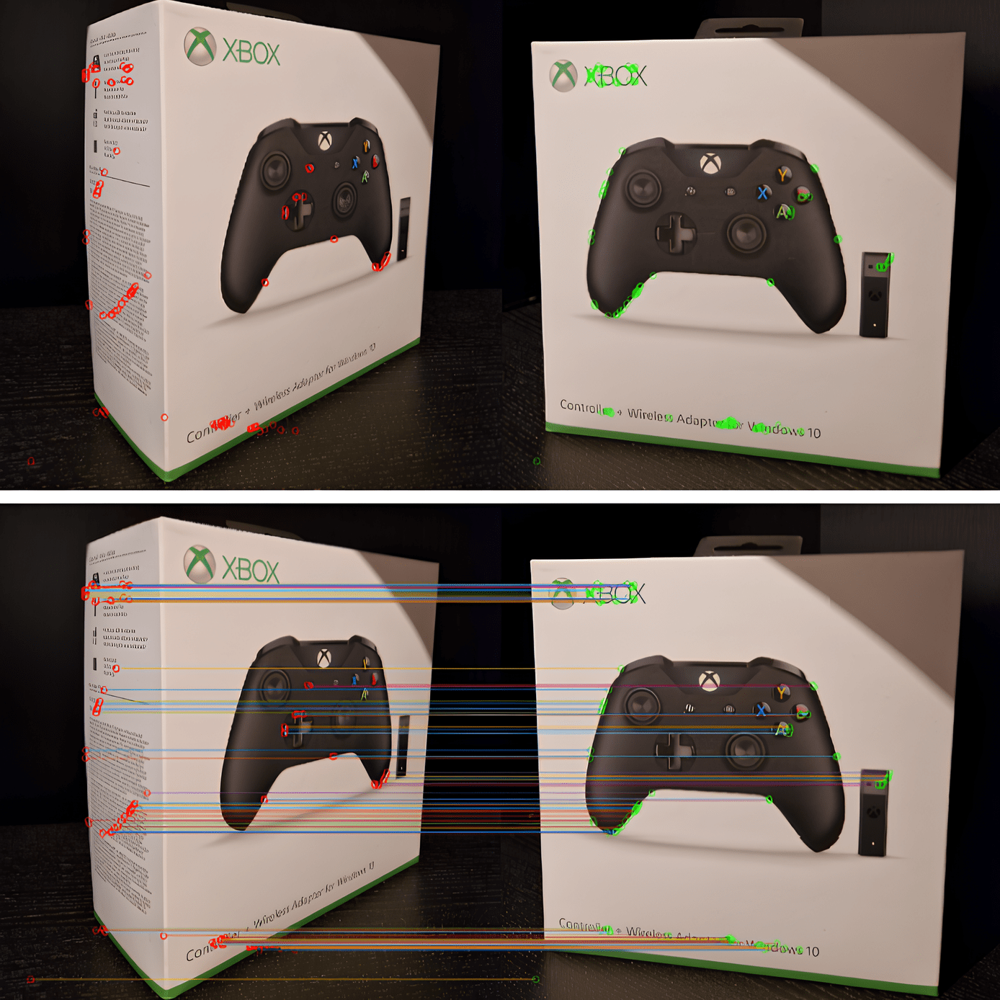

# K-means image clasification

## Steps
1. Gaussian filters have been applied to smooth the image.
2. Calculated the gradients of the image using the Prewitt kernel.
3. Obtain the autocorrelation matrix and reduce noise with the Gaussian filter.
4. Remove non-maximum corners.
5. Obtain the top 100 corners with the highest values.
6. Visualization

## Result

